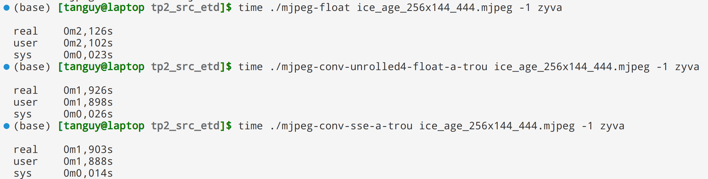

# Rapport TP SIMD

## QUESTION 3

Voici les perfs obtenue avec les 3 implémentations différentes :

On peut voir que les deux méthodes développées dans la question 1 et 2 sont plus rapide que la méthode des floattant. La méthode avec l'utilisation des instructions simd est légèrement plus rapide que la méthode de déroulage de la boucle. Une vidéo plus longue aurait certainement permit d'avoir un différence un peu plus significative.
